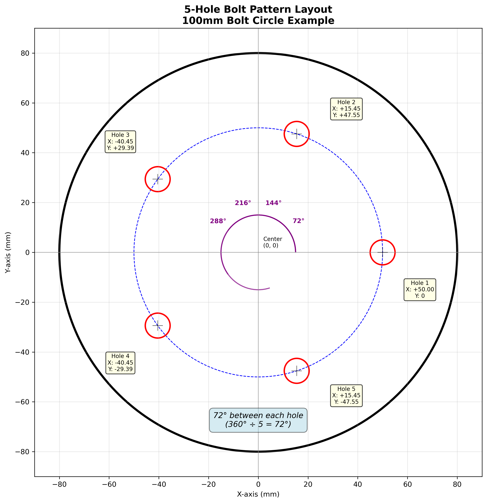
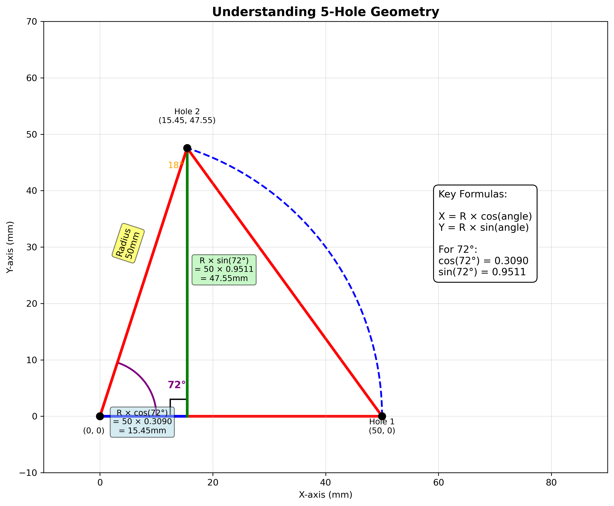
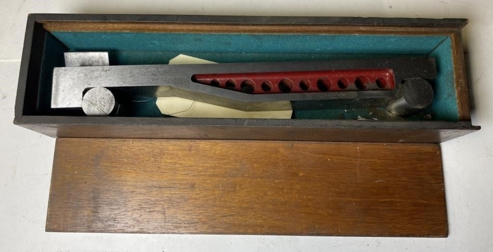
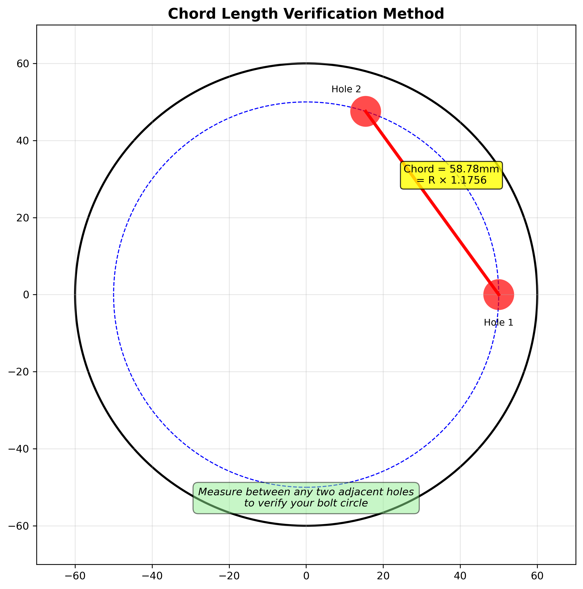

# Pentagon (5-Hole) Bolt Circle Pattern

## The Oddball

The 5-hole pattern is the weirdo. No nice round numbers here, no
simple fractions. With 4, 6, or 8 holes, you get nice angles that
play well with shop math. But 5 holes? That's 72° spacing (360° ÷ 5 =
72°), and 72° doesn't give you any of those _clean_ ratios.

## Understanding The Problem

For a 5-hole pattern, you're going to need:

- **Sin(72°) = 0.9511**
- **Cos(72°) = 0.3090**
- **Sin(36°) = 0.5878**
- **Cos(36°) = 0.8090**

Sorry, I don't have any mnemonic tricks to help you remember this
one. Not exactly numbers you'll memorize like 0.7071 or 0.86603.
Just bookmark this tutorial.

## Practical Method

There is a practical method though. So here's how I do it without
borking my brains.

### Step 1: First Hole on the X-axis

Start simple. Put your first hole on the positive X-axis:

- **Hole 1**: X = +R, Y = 0

### Step 2: Calculate the Other Four

For a radius R, here are your coordinates:

1. **Hole 1**: X = +R, Y = 0 (0°)
2. **Hole 2**: X = +R × 0.3090, Y = +R × 0.9511 (72°)
3. **Hole 3**: X = -R × 0.8090, Y = +R × 0.5878 (144°)
4. **Hole 4**: X = -R × 0.8090, Y = -R × 0.5878 (216°)
5. **Hole 5**: X = +R × 0.3090, Y = -R × 0.9511 (288°)

### Example: 100mm Bolt Circle

For a 100mm diameter bolt circle (50mm radius):

1. **Hole 1**: X = +50.00, Y = 0
2. **Hole 2**: X = +15.45, Y = +47.55
3. **Hole 3**: X = -40.45, Y = +29.39
4. **Hole 4**: X = -40.45, Y = -29.39
5. **Hole 5**: X = +15.45, Y = -47.55

_Figure 1: Complete 5-hole pattern layout with coordinates_

### Understanding the Math

Here's how we get from angles to coordinates:

_Figure 2: The trigonometry behind the weird numbers_

## Shortcuts Are Nice

### Method 1: The Template

Once you calculate one 5-hole pattern, make a template. Drill it
in aluminum plate and keep it on your pegboard. Future you will
thank present you.

### Method 2: CAD Cop-Out

It's 2025 and we all have pocket sized supercomputers. Fire up a
CAD app, draw your bolt circle, array 5 holes, read the coordinates.
No shame in using technology.

### Method 3: Grandpa's Sine Bar

_Some dead guys sine bar, probably._

If you have inherited a sine bar and you're feeling saucy:

1. Set sine bar to 72°
2. Drill first hole
3. Rotate part and sine bar together
4. Repeat 4 more times

## Quick Reference Table

| Circle | R    | H1      | H2          | H3           |
| ------ | ---- | ------- | ----------- | ------------ |
| 80mm   | 40   | (40, 0) | (12.36, 38) | (-32.36, 24) |

| Circle | H4           | H5          |
| ------ | ------------ | ----------- |
| 80mm   | (-32.36, -24) | (12.36, -38) |
| 100mm  | (-40.45, -29) | (15.45, -48) |
| 127mm  | (-51.37, -37) | (19.62, -60) |

| Circle | R    | H1       | H2          | H3          |
| ------ | ---- | -------- | ----------- | ----------- |
| 100mm  | 50   | (50, 0)  | (15.45, 48) | (-40.45, 29) |
| 127mm  | 63.5 | (63.5,0) | (19.62, 60) | (-51.37, 37) |

## The Constants

Instead of memorizing sines and cosines, just remember these
multipliers for your radius:

- **Position 1**: X = R × 1.0000, Y = 0
- **Position 2**: X = R × 0.3090, Y = R × 0.9511
- **Position 3**: X = R × -0.8090, Y = R × 0.5878
- **Position 4**: X = R × -0.8090, Y = R × -0.5878
- **Position 5**: X = R × 0.3090, Y = R × -0.9511

Some old guys have these on a card taped to the mill. It works
┐( ͡° ʖ̯ ͡°)┌

## Verification

The distance between adjacent holes should be:

- **Chord length** = R × 1.1756

This is harder to measure than diameter, but it's what you've got.

_Figure 3: Measuring chord length to verify your pattern_

## Real Talk

5-hole patterns are rare for a reason. They're a pain in the ass.
If you're designing something and thinking "hmm, 5 bolts would be
perfect here"

- stop. Use 4. Use 6.
Your machinist might even buy you a beer. 🍻

But when you absolutely must do a 5-hole pattern (yeah, I'm looking
at you low-rider wheel adapter dudes), now you know how. Just don't
expect it to be fun.

## Pro Tip

If you find yourself doing a lot of 5-hole patterns, invest in a
rotary table or a dividing head. Set it to 72° increments and save
your sanity. The math works, and it's a cool flex, but a rotary table
works better.
